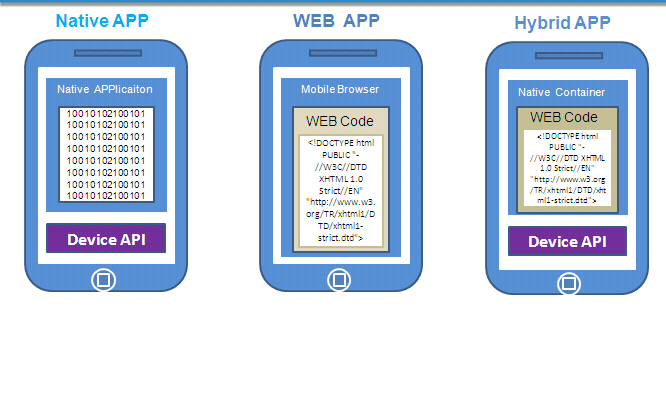

# react-native - day1


## 1. 关于App开发的几个概念


### 1.1 什么是App


App 是 `Application`的一个缩写；可以**安装**以及**运行**于操作系统之上的软件，叫做APP；


### 1.2 App的分类


- 按照平台来划分：

  - PC端App：运行在 笔记本 或 台式机之上的软件；Office套装、代码编辑器....

  - 移动端App：就是手机应用商店中可以下载安装的软件；手机QQ、美团....

- 按照功能来划分：

  - 游戏App：王者荣耀、LOL、Dota

  - 应用App：手机百度、百度糯米、办公类型的软件、视频软件【非游戏性质的软件】


### 1.3 App和Web的区别


- APP：特指需要 安装的 软件；

  - 优点：功能强大、对网络依赖没有那么强，可以脱机运行；体验流畅；

  - 缺点：安装体积会比较大；占电脑磁盘；最大的缺点就是无法跨平台；


- Web：特指**基于 浏览器**呈现的 html 页面；

  - 优点：免安装，体积小，方便，简单易用；最大的优点就是跨平台；（Web 天生就是跨平台的）

  - 缺点：脱机之后几乎不能运行；对网络要求比较高；体验度没有App流畅；


### 1.4 移动端三大App开发方式的介绍


> 思考：

>

> 1. **苹果系统**上的软件是如何开发出来的？ 

>    + 使用IOS平台推荐的开发语言，OC、Swift开发出来的；

>

> 2. **安卓系统**上的软件又是如何开发出来的？

>    + 使用Android平台推荐的开发语言，Java + Android控件和API开发出来的；

>

> 3. 苹果和安卓平台上**共有的软件**是如何开发出来的？

>

>    + 共有的软件，可以使用 混合 App 开发的方式；就是使用前端的技术（HTML + CSS + Javascript），结合一些App开发框架，快速进行手机App开发；

>

>

>    + 方案1： 有两套开发人员；

>    + 方案2：有没有一种跨平台的开发方案；也就是，只有一套开发人员，负责开发一套跨平台的项目，然后发布到两个平台；

>    + 优点：

>      + 企业成本低；

>      + 开发周期比较可控一些；


1. **WebApp（网站App）**：本质还是基于浏览器的网站；基于浏览器的、功能复杂的网站；


   + 例如：http://m.jd.com/、https://h5.m.taobao.com/#index、http://naotu.baidu.com

   + 优点：免安装、打开即用；跨平台；

   + 缺点：严重依赖于网络；


2. **NativeApp（原生App）**：直接由 安卓 或 IOS 原生开发语言，做出来的手机软件；


   + 优点：体验好、适合做游戏；性能非常高；


   - 缺点：开发出来的软（卵）件无法跨平台；


3. **HybirdApp（混合App）**：使用前端技术结合App开发框架，进行手机App开发；


   + 优点：跨平台；

   + 缺点：几乎不能做游戏开发；


### 1.5 移动端三大App开发方式的原理和对比





原生App体验好但是无法跨平台；


WebApp可以跨平台但是体验不好；


前端做的混合App开发 融合了前两者的优点（优势比较大）；


## 2. 为什么要学混合App开发


### 2.1 从程序员的角度分析：


1. 挣钱多

2. 对于找工作来说：提高行业竞争力；

3. 能接触到前端流行的技术和框架（前端做移动App，要有 三大框架 的学习基础）


   + 前端是一个永恒的行业???随着年月的累计，行业只会对前端从业人员的要求越来越高；

   + 屌丝的崛起之路：`只能做页面` -> `Ajax前后台数据交互` -> `Jquery、Bootstrap` -> `前端的框架兴起` -> `可以做手机混合App/桌面应用(Electorn)` -> `可以做手机原生App(React-Native、Weex)` -> `将来或许可以发射火箭发射卫星发射导弹` -> `终极目标：统一全宇宙`

4. 能购置一批牛逼的设备；


> 注意：混合App开发是一个大的概念；在 混合 App开发概念之下，又有 纯粹的混合App 和 前端原生App开发；


### 2.2 从企业的角度分析:


- 节省开发时间：因为前端搞App开发，技术难度比较低，开发速度快； 时间就是效率，效率就是金钱；


- 节省开发费用：只需要一套开发人员即可；

- 快速占领市场：现在人缺的不是idea,而是快速把 idea 变成 现实项目的一个问题；


> [谁在使用React Native？？？](https://facebook.github.io/react-native/showcase.html)


## 3. 企业如何选择合适自己的App开发方式


> 在企业中，可供选择的手机App开发方式，有 原生App开发 和 混合App开发；


1. 如果企业中，之前就有原生App开发的经验积累；适合继续使用原生App开发；

2. 如果企业中，老项目是用原生App开发的，推荐继续使用原生的方式进行维护；

3. 如果企业中，由新项目，急需上线占领市场，此时，可以优先考虑使用 前端App开发；

   + 裤衩开发：


## 4. 企业中项目开发流程


- 需求调研：产品定位、受众群体、市场需求、开发价值；【产出物：需求文档】

- 产品设计：功能模块、流程逻辑；【产出物：设计文档，交互稿】，确定项目的基本功能；

- 项目开发：项目架构、美工、前端、后台、测试【产品的把控】**要理解前后端分离的概念**

- 运营维护：上线试运行、调Bug、微调功能模块、产品迭代


> 根据需求搞设计，根据设计做开发


## 5. 企业技术选型 - 几大主流技术之间的关系


1. Angular.js 和 Ionic


   + [Angular1官网](https://angularjs.org/)

   + [Angular2官网](https://angular.io/)

   + [Ionic 中文网](http://www.ionic.wang/)

   + [Ionic 英文官网](http://ionicframework.com/getting-started/)


2. Vue.js 和 Weex


   + [Vue.js官网](https://cn.vuejs.org/)

   + [Weex官网](http://weex.apache.org/cn/)

   + [Weex - github地址 - 新](https://github.com/apache/incubator-weex)

   + [Weex - github地址 - 旧](https://github.com/alibaba/weex)


3. React.js 和 React-Native


   + [React.js英文官网](https://facebook.github.io/react/)

   + [ReactNative中文网](http://reactnative.cn/)

   + [ReactNative英文网](http://facebook.github.io/react-native/)


> Angular, Vue, React 这三个都是**web前端框架**，我们在进行混合App开发的时候，只是用到了这三个框架的基础语法而已；

> Ionic， Weex， ReactNatvie 这三个都是移动App开发框架，能开发手机App；都提供了**现成的移动App开发组件** 和 **集成了手机App打包工具**；


## 6. 什么是react-native


1. react-native官网中对RN的定义：

   - Build native mobile apps using JavaScript and React

   - A React Native app is a real mobile app

2. 自己为react-native下个定义：基于前端的JS和React语法，开发出原生手机App的框架；


## 7. 主流前端App开发框架和对比

### 7.1 主流前端App开发框架


1. Html5+、Ionic、ReactNative、Weex


1. [认识HTML5+](http://www.html5plus.org/#home)

   + h5+是一个中国的产业联盟，它有一些互联网成员，专门在中国推广和发展H5相关的技术；


3. [HBuilder官网](http://www.dcloud.io/)


### 7.2 开发框架之间的区别


1. 第一类框架：Html5+ 和 Ionic 

2. 第二类框架：ReactNative 和 Weex


### 7.3 主流技术开发出来的App区别


1. HTML5+ 开发出来的是 H5 类型的App

2. Ionic 开发出来的是 Hybird App

3. RN 、Weex 开发出来的是 Native App


## 8. 使用HBuilder“在线”生成安卓应用

[API地址](http://www.html5plus.org/doc/h5p.html)


1. 新建项目：`文件 -> 新建 -> 移动App`

2. 进行项目基本的配置，修改`manifest.json`配置文件并保存即可；

3. 把之前做好的 `vue-cms`网站项目，替换到当前这个移动App项目中；

4. 在当前移动App项目根目录上，右键，选择`发行 -> 云打包 打原生安装包`


> 注意：使用Hbuilder在线打包，本地不需要配置打包环境；所谓的在线，就是 Hbuilder 把我们的项目打包发送到 云端的服务器，服务器打包好之后，再通过网络，把 apk 文件返回给我们；


## 9. 环境变量的使用


> 什么是环境变量：就是在整个操作系统之中，配置的全局生效的一些变量；


1. 分为 用户环境变量 和 系统环境变量；

2. 注意：在做IT开发的时候，一般都要把环境变量配置到`系统环境变量中`，否则，很容易报错；

3. `Path环境变量`：作用是可以通过命令行的形式，让用户或其它应用程序，不管在哪个目录下，都能够直接运行某些应用程序；


## 10. 移动App开发环境配置【重点】


### 1. 安装最新版本的java jdk

1. 修改环境变量，新增`JAVA_HOME`的系统环境变量，值为`C:\Program Files (x86)\Java\jdk1.8.0_112`，也就是安装JDK的根目录

2. 修改系统环境变量`Path`，在`Path`之后新增`;%JAVA_HOME%\bin;%JAVA_HOME%\jre\bin`

3. 新建**系统环境变量**`CLASSPATH`，值为`.;%JAVA_HOME%\lib\dt.jar;%JAVA_HOME%\lib\tools.jar;`

4. 保存所有的系统环境变量，同时退出系统环境变量配置窗口，然后运行cmd命令行工具，输入`javac`，如果能出现javac的命令选项，就表示配置成功！


### 2. 安装Node.js环境

注意：需要安装最新的长期稳定版本，不要实验版本；安装完毕之后的node.js会自动配置到全局系统环境变量中

安装完毕后，可以输入`node -v`查看node版本号；


### 3. 安装C++环境

**注意：大多数情况下操作系统自带C\++环境，不需要手动安装C\++环境；**

如果运行报错，则需要手动安装visual studio中的C\++环境；


### 4. 安装Git环境

Git安装完毕后，会自动配置到系统环境变量中；

可以通过运行`git --version`来检查是否正确安装和配置了Git的环境变量；


### 5. 安装Yarn包管理工具


> 什么是yarn：和 npm 性质差不多，都是前端的包管理工具；

>

> 注意：在 React Native 开发过程中，推荐直接使用 yarn 来安装依赖包；

>

> 注意：在 RN 学习中，不要使用 npm 和 cnpm ，因为它们装的包，路径有问题，或者会出现丢包的情况；


在下发给各位同学的安装包中，找到`Yarn`的安装文件，双击直接安装即可；


### 6. 安装Python环境

1. 注意：安装Python时候，只能**安装2.×的版本**，注意勾选安装界面上的`Add Python to path`，这样才能自动将Python安装到系统环境变量中；

2. 安装完毕之后，可以在命令行中运行`python`，检查是否成功安装了python。


### 7. 配置安卓环境

1. 安装`installer_r24.3.4-windows.exe`，最好手动选择安装到C盘下的android目录

2. 打开安装的目录，将`android-23`、`android-24`、`android-25`、`android-26`右键 `x` 解压后，放到`platforms`文件夹下

3. 右键 `x` 解压`platform-tools`，将解压得到的文件夹，放到和`SDK Manager.exe`平级的目录中

4. 在安装目录中新建文件夹`build-tools`，右键 `x` 解压 `build-tools_r23.0.1-windows.zip(react-native必须依赖这个)`、`build-tools_r26.0.0-windows.rar(weex必须依赖这个)`，并将解压出来的文件夹，拷贝到`build-tools`文件夹下

5. 在安装目录中，新建`extras`文件夹，在`extras`文件夹下新建`android`文件夹；右键 `x` 解压`m2responsitory`文件夹和`support`文件夹，放到新建的`extras -> android`文件夹下

6. 配置安装环境变量：在系统环境变量中新建`ANDROID_HOME`，值为android SDK Manager的安装路径`C:\Users\liulongbin\AppData\Local\Android\android-sdk`，紧接着，在Path中新增`;%ANDROID_HOME%\tools;%ANDROID_HOME%\platform-tools;`


## 11. [ReactNative快速打包](http://reactnative.cn/docs/0.42/getting-started.html)

1. 安装完node后建议**设置npm镜像**以加速后面的过程（或使用科学上网工具）。注意：**不要使用cnpm！**cnpm安装的模块路径比较奇怪，packager不能正常识别！


   > npm config set registry https://registry.npm.taobao.org --global


   > npm config set disturl https://npm.taobao.org/dist --global


2. Yarn 和 React Native的命令行工具（react-native-cli）


   + Yarn是Facebook提供的替代npm的工具，可以加速node模块的下载。

   + React Native的命令行工具用于执行创建、初始化、更新项目、运行打包服务（packager）等任务。


   > npm install -g react-native-cli


   + 安装完yarn后同理也要设置镜像源：


   > yarn config set registry https://registry.npm.taobao.org --global


   > yarn config set disturl https://npm.taobao.org/dist --global


3. 运行`react-native init AwesomeProject`创建React-Native项目


4. 运行`cd AwesomeProject`切换到项目根目录中，运行`adb devices`来确保有设备连接到了电脑上


5. 运行`react-native run-android`打包编译安卓项目，并部署到模拟器或开发机中


6. 运行上一条命令之前，要确保有设备连接到了电脑上，可以运行`adb devices`查看当前接入的设备列表；如果无法检查到设备列表，请先确保手机开启了`开发者模式`，同时要电脑上要安装手机的驱动程序；


7. **注意：**首次打包时候，会联网下载`gradle`相关的文件，需要等待很长时间，大家可以直接从`http://www.androiddevtools.cn/`手动下载对应版本的`gradle`文件，并手动拷贝解压到`C:\Users\自己的用户名\.gradle\wrapper\dists`目录下；


8. **注意：**接下来，如果是第一次打包，会从`https://jcenter.bintray.com`下载好多的依赖项，此时需要耐心等待，如果中间出现了长时间卡顿，大家需要`Ctrl+C`停止打包，并重新运行`react-native run-android`


## 12. [Weex快速打包](http://weex.apache.org/cn/guide/tools/toolkit.html)

1. 安装依赖:Weex 官方提供了 weex-toolkit 的脚手架工具来辅助开发和调试。首先，你需要最新稳定版的 Node.js 和 Weex CLi。

2. 运行`npm install -g weex-toolkit`安装Weex 官方提供的 `weex-toolkit` 脚手架工具到全局环境中

3. 运行`weex create project-name`初始化Weex项目

4. 进入到项目的根目录中，打开cmd窗口，运行`weex platform add android`安装android模板，首次安装模板时，等待时间较长，建议fq安装模板

5. 打开`android studio`中的`安卓模拟器`，或者将`启用USB调试的真机`连接到电脑上，运行`weex run android`，打包部署weex项目

6. 部署完成，查看项目效果


## 总结重点

1. 什么是前端移动App开发

2. 市面上常见的App开发方式及优缺点

3. 使用Hbuilder在线生成安卓应用

4. 学会配置ReactNative开发环境

5. 掌握ReactNative打包流程


# react-native - day2


## 1. 配置RN基本的开发环境

请大家参考rn课程第1天笔记中的【10. 移动App开发环境配置】进行开发环境的配置；

1. 注意：自己电脑的用户名必须是英文的；否则，在进行RN项目编译的时候，会报错；
2. 如果在第一次进行项目编译的时候，可能会联网下载很多的包，第一次编译，一定要确保自己的电脑联网了；
3. 我们可以手动的，把一个叫做 `gradle-2.14.1-all.rar`的压缩包，手动拷贝到`C:\Users\自己的用户名文件夹\.gradle\wrapper\dists`，右键`x`解压出来即可；
4. 当我们手动把 `gradle` 解压出来以后，在此运行`react-native run-android`命令，此时，还会联网下载许多的依赖包，此时，耐心等待即可；如果中间，某个包下载很久还没成功，此时`Ctrl+C`终止这次打包，重新运行`react-native run-android`;


##2. 对手机进行相关配置

1. 要把自己的安卓手机，开启开发者模式，并勾选USB调试；
2. 我们需要为自己的手机，信任这台开发的电脑；就是当手机连上电脑以后，`允许USB调试`；
3. 要把自己的手机USB，选择为`MTP 文件传输模式`；
4. 针对于不同的电脑，要保证电脑上，正确安装了 手机的USB驱动；
5. 如果以上步骤，都正确进行操作了，但是还无法通过`adb devices`查看到手机，则考虑自己手机是否为 oppo 和 vivo；


## yarn使用说明

> yarn 作用和 npm 完全一样，但是从体验上来说，yarn 更胜一筹； 而且 ， RN 中只能使用 yarn 装包，千万不要用 `cnpm` 或 `npm`;

1. 装包运行 `yarn add jquery`，这里不需要指定 `--save` 或 `-S` ，因为 yarn 默认就是安装到了 `dependencies` 节点下；
2. 运行 `yarn add webpack -D`， 这里的 `-D` ，就表示，把对应的包，安装到 `devDependencies` 节点下；
3. 运行 `yarn remove 包名` 就可以卸载包，同时，会自动 把 `package.json`中记录的包信息删除；
4. `yarn init -y`表示快速初始化一个 包管理配置文件，如果在项目中，不初始化就装包，也会出现 安装到 用户目录下的问题；
5. 运行 `yarn` 可以安装所有在 `package.json` 中记录的包；


## 3. 搭建RN项目

1. 注意：RN项目，必须放在纯英的目录下，否则 运行会报错！


## 4. 项目结构介绍

> 参考博客：[react-native之项目结构分析](http://blog.csdn.net/dachaoxuexi/article/details/78676291)

1. 在项目的根目录中，通过 终端 运行 `react-native start` 可以快速启动 `packager server`


## 5. 修改项目首屏页面


## 6. 使用样式

1. `Text`组件支持 `textAlign`，但是 `View`不支持；
2. 在 网页中，一个 div 盒子，默认 没有启用 `flexbox` 布局，所以需要手动 设置 `display: flex;`；但是， 在 RN 中，默认 每个 `View` 组件，都是启用了 `flexbox` 布局的；
3. 注意：在 网页中，默认 主轴 是 横向的（从左到右），用 `justifyContent` 来进行控制； 默认网页中，侧轴 是 纵向的（从上到下）， 用 `alignItems` 来进行控制；
4. 但是，在 RN 中，默认主轴是纵向的，因此，``justifyContent` 控制的是纵向上的对齐方式； 默认 侧轴 是横向的，因此，`alignItems `控制 水平方向上的对其方式；


## 7. 基本组件的使用介绍

- View：相当于网页中的 div 元素，主要负责布局；

- Text：相当于网页中的 span 元素，主要用来展示文本；

- TextInput：文本框组件

  1. 默认在安卓平台有默认底边框，需要使用`underlineColorAndroid="transparent"` 来隐藏底边框；
  2. 在 RN 中，为元素设置边框，不能直接使用`border`，要使用 各自 拆开的属性`borderWidth`、`borderColor`
  3. `keyBoardType` 是 `enum` 枚举类型；

- Image：用来在 RN 中显示图片；

  - 显示本地图片：

    ```jsx
    {/* 引用本地的图片资源 */}
    <Image source={require('./images/1.jpg')}/>
    ```

  - 显示网络上的图片

    ```jsx
    {/* 引用 网络上的 图片资源 */}
    {/* 如果引用网络上的图片，除了指定 source 之外，还要通过 样式指定 宽 和 高 */}
    <Image source={{ uri: 'https://ss1.bdstatic.com/70cFuXSh_Q1YnxGkpoWK1HF6hhy/it/u=3878847766,3988120331&fm=200&gp=0.jpg' }} style={{ width: 150, height: 150 }} />
    ```

- Button：按钮组件

- Touchable 系列组件，提供了响应 点击事件的能力：

  - TouchableHighlight：效果 `activeOpacity `可以设置被点击元素的透明度；`underlayColor ` 可以设置背景色；
  - TouchableOpacity：只能够改变透明度
  - TouchableNativeFeedback：安卓下原生的视觉反馈;
    - `background={TouchableNativeFeedback.SelectableBackground()}` 只有灰色的涟漪效果，并且超出 `View` 区域；
    - `background={TouchableNativeFeedback.SelectableBackgroundBorderless()}`只有灰色的涟漪效果，但是，涟漪会超出 `View` 区域；
    - `background={TouchableNativeFeedback.Ripple('red', false)}` 既可以配置 涟漪颜色，又可以配置涟漪是否可以超出 `View` 区域；

- ActivityIndicator：loading效果

- ScrollView：页面的滚动组件；被 ScrollView 包裹的元素，如果超出了屏幕的高度，会自动添加滚动条；

  - 注意：在使用 此组件的时候，最好为 `ScrollView` 添加 `style={{ flex: 1 }}`样式，使其撑满父元素
  - 应用场景：那些不是用 `for` 循环创建出来的 `列表` 都可以使用 `ScrollView` 包裹；

- FlatList ：使用 `FlatList ` 适合做列表渲染；

  - 最精简的用法：

    ```jsx
    <FlatList
            data={this.state.mylist1} // 要渲染的数据
            // renderItem 是来渲染每一项的，指定了每一项 要被渲染成 什么样子
            renderItem={({ item, index }) => <View>
              <Text style={{ lineHeight: 150 }}>编号：{item.id} --- 姓名：{item.name} --- 年龄：{item.age}</Text>
            </View>}
            keyExtractor={(item, index) => item.id + ''} // 表示 自定义key
          />
    ```

    ​


## 相关文章

1. [Win10怎么开启超级管理员administrator帐户](https://jingyan.baidu.com/article/fdffd1f87f7d6ff3e98ca1ff.html)
2. [Win10怎么将中文登录用户文件夹名改为英文名?](https://jingyan.baidu.com/article/27fa732689e0eb46f8271f27.html)

# 安装处问题了

android-2.2_r1
链接: <https://pan.baidu.com/s/1qYfwxEO> 密码: r217

android-2.3.7_r1
链接: <https://pan.baidu.com/s/1qYqRB1E> 密码: qcei

android-4.1.1_r1
链接: <https://pan.baidu.com/s/1mhXwVgc> 密码: qidj

android-4.3_r1
链接: <https://pan.baidu.com/s/1geOJDB1> 密码: 355a

android-4.4.4_r1
链接: <https://pan.baidu.com/s/1nuZwEVn> 密码: t3qw

android-wear-5.1.1_r1
链接: <https://pan.baidu.com/s/1hrQJ6XQ> 密码: 3g3x

android-6.0.0_r1
链接: <https://pan.baidu.com/s/1geHYeOz> 密码: fsd6

android-6.0.1_r2
链接: <https://pan.baidu.com/s/1skEVR1F> 密码: ik6t

android-7.1.1_r1
链接: <https://pan.baidu.com/s/1dF6hc3n> 密码: pfsq

android-8.0.0_r1
链接: <https://pan.baidu.com/s/1bqKNx3x> 密码: bthv